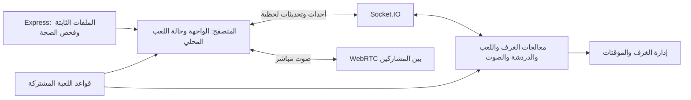

# أتقدم للوظيفة

لعبة مقابلة عمل جماعية، تتحول فيها الإجابات الجادة إلى مواقف غير متوقعة. يتناوب اللاعبون على الدفاع عن أنفسهم أمام المدير.

يمكن لعبها وجهًا لوجه من جهاز واحد، أو عن بُعد عبر غرف أونلاين تدعم الدردشة والتفاعل الصوتي.

> **الفكرة في جملة:** أجب عن سؤال المقابلة، دافع عن إجابتك حين تظهر لك بطاقة التوريط، وحاول أن تكون آخر متقدم صامد.

## محتويات README

- [كيف تُلعب؟](#كيف-تلعب)
- [ما الذي يقدمه المشروع؟](#ما-الذي-يقدمه-المشروع)
- [التقنيات](#التقنيات)
- [كيف يعمل التطبيق؟](#كيف-يعمل-التطبيق)
- [تشغيل المشروع](#تشغيل-المشروع)
- [هيكل الملفات](#هيكل-الملفات)
- [ملاحظات مهمة](#ملاحظات-مهمة)

## كيف تُلعب؟

1. يبدأ المدير جولة بسؤال مقابلة.
2. يكتب اللاعبون إجابات توريطية سرية، ثم يوزّعها النظام على المتقدمين دون أن يحصل اللاعب على إجابته هو.
3. يدافع كل متقدم عن نفسه خلال الوقت المحدد، ويحاول تفسير الإجابة التي ظهرت له.
4. يختار المدير لاعبًا للاستبعاد، ثم تبدأ جولة جديدة.
5. عندما يقترب اللاعبون من الجولة الأخيرة، تتغير جهة كتابة إجابات التوريط وفق قواعد اللعبة. يصل الناجي إلى سؤال نهائي، ثم يقرر المدير النتيجة.

في **اللعب المحلي**، يمرّر اللاعبون الجهاز فيما بينهم. وفي **اللعب أونلاين**، ينشئ المدير غرفة ويشارك رمزها مع بقية اللاعبين.

## ما الذي يقدمه المشروع؟

| التجربة | التفاصيل |
| --- | --- |
| لعب محلي | لعبة أدوار على جهاز واحد، مع حفظ حالة اللعبة في المتصفح لاستعادتها. |
| غرف أونلاين | إنشاء غرفة أو الانضمام إليها برمز، مع مزامنة الحالة لحظيًا. |
| إدارة الجولة | أسئلة المقابلة، إجابات التوريط، الدفاع، الاستبعاد، والجولة النهائية. |
| استعادة الاتصال | رموز جلسات لاستعادة اللاعب أو المدير عند انقطاع الاتصال، وآلية للتعامل مع غياب المدير. |
| الدردشة والتفاعل | رسائل، رموز تعبيرية، ملصقات، ومؤشرات المتحدثين. |
| الصوت | محادثة صوتية مباشرة بين أعضاء الغرفة، مع وضع الضغط للتحدث أو التبديل. |
| تخصيص الواجهة | سمات بصرية وإعدادات صوت محفوظة محليًا. |

## التقنيات

- **Node.js** لتشغيل الخادم.
- **Express 5** لتقديم ملفات التطبيق ونقطة فحص الحالة.
- **Socket.IO 4** للغرف والأحداث الفورية بين الخادم والمتصفحات.
- **HTML وCSS وVanilla JavaScript Modules** لبناء واجهة المتصفح دون إطار عمل واجهات.
- **WebRTC** لنقل الصوت بين المشاركين، مع استخدام Socket.IO لتبادل إشارات الاتصال.
- **localStorage** لحفظ إعدادات المستخدم وحالة اللعب المحلي والجلسة الأونلاين.
- **قواعد JavaScript مشتركة** تستخدمها الواجهة والخلفية لتوحيد بعض قرارات اللعب.

## كيف يعمل التطبيق؟



### الخادم

يبدأ `server.js` خادم HTTP فقط. تجهّز `backend/src/app.js` تطبيق Express وSocket.IO، بينما يحتوي `backend/src/createBackend.js` على منطق تنسيق اللعبة والخادم. تتولى وحدات `core/` بيانات الغرف والمؤقتات، وتتولى `socket/handlers/` أحداث الغرف واللعب والدردشة والصوت.

عند إرسال حالة الغرفة، ينشئ الخادم نسخة منقّحة خاصة بكل اتصال. لا تُرسل إجابة التوريط الخاصة بالدور الحالي إلا لصاحب الدور، ولا تظهر الإجابة المكشوفة للآخرين قبل وقت الكشف. هذا يحمي المعلومات السرية من التسرب عبر تحديثات الحالة.

### المتصفح

نقطة الدخول هي `public/js/main.js`، ومنها يبدأ `gameController.js` تنسيق الواجهة وتدفق اللعب. الوظائف المساندة مفصولة إلى وحدات للصوت والدردشة والواجهة والصوت المباشر. تتواصل الواجهة مع الخادم عبر `public/communication.js`، وتستخدم `shared/gameRules.js` مع الخادم للحفاظ على قواعد متطابقة.

## تشغيل المشروع

### المتطلبات

- Node.js بإصدار يدعم ميزات JavaScript المستخدمة في المشروع.
- npm.

### التثبيت والتشغيل

```bash
git clone <رابط-المستودع>
cd <مجلد-المشروع>
npm install
npm start
```

افتح [http://localhost:3000](http://localhost:3000) في المتصفح. الأمر `npm run dev` متاح أيضًا ويشغّل الخادم بالطريقة نفسها.

لتغيير المنفذ:

```bash
PORT=4000 npm start
```

في PowerShell على Windows:

```powershell
$env:PORT = 4000
npm start
```

يمكن التحقق من أن الخادم يعمل عبر المسار `/health`؛ يعيد استجابة JSON بحالة `ok`.

## هيكل الملفات

```text
.
├── backend/
│   └── src/
│       ├── app.js                    # إعداد Express وSocket.IO والملفات الثابتة
│       ├── createBackend.js          # تنسيق منطق الخادم واللعبة
│       ├── config/constants.js       # الإعدادات والمدد الزمنية
│       ├── core/                    # الغرف وإدارتها والمؤقتات
│       └── socket/
│           ├── index.js              # تسجيل معالجات الأحداث
│           └── handlers/             # الغرف واللعب والدردشة والصوت
├── public/
│   ├── index.html
│   ├── style.css
│   ├── communication.js             # اتصال Socket.IO من المتصفح
│   ├── gameState.js                 # حفظ حالة اللعب المحلي
│   └── js/
│       ├── main.js                   # نقطة دخول وحدات الواجهة
│       ├── gameController.js         # تنسيق تدفق اللعب والواجهة
│       └── modules/                  # الواجهة والصوت والدردشة والصوت المباشر
├── shared/
│   └── gameRules.js                  # قواعد مشتركة بين الطرفين
├── img/                              # الصور وملفات الهوية البصرية
├── server.js                         # تشغيل الخادم
└── package.json
```

## ملاحظات مهمة

- يحتاج الصوت إلى إذن استخدام الميكروفون من المتصفح. يعمل الوصول إليه على `localhost`، أما النشر فعادةً فيتطلب HTTPS.
- اتصال WebRTC الحالي يضبط خادم STUN عامًّا. قد تحتاج البيئات المقيدة أو الإنتاج إلى إعداد TURN لتحسين الاتصال.
- حالات الغرف واللعب الأونلاين محفوظة في ذاكرة الخادم؛ إعادة تشغيل العملية تنهي الغرف النشطة.
- لا يعرّف `package.json` حاليًا أوامر اختبار آلية.

## الترخيص

المشروع مُعرّف بترخيص MIT في `package.json`.
